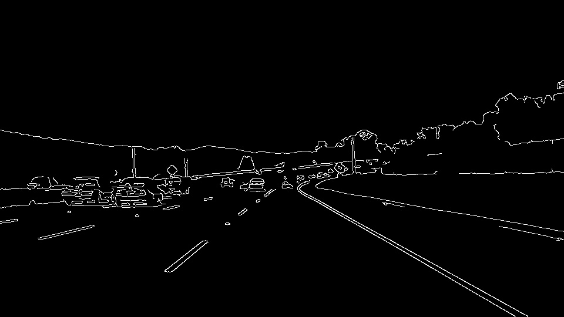

# **Finding Lane Lines on the Road** 

## Overview
---

Recognizing lanes on the road is one of the essential tasks which human drivers perform well. It’s possible because nature with evolution gifted us perfect sensors. Autonomous systems are only at the beginning of their epoch. It’s a non-trivial task for any robot to read and interpret data about the world around them. [Computer Vision](https://en.wikipedia.org/wiki/Computer_vision) tries to eliminate the gap between us, humans, and robots.

The goal of the project is to recognize lanes on the road with some limitations:
-	The recognition isn’t real-time
-	There’re good weather conditions. It’s a sunny day
-	The car is moving along a straight line on the highway
-	Lines are visible
-	The traffic isn’t dense

The project is a part of [Udacity Become a Self-Driving Car Engineer](https://www.udacity.com/course/self-driving-car-engineer-nanodegree--nd013).

All source codes and assets are available on [GitHub](https://github.com/alexander-stadnikov/CarND-Finding-Lane-Lines).

## The project setup
---

The project consists of a notebook and assets.

There’re two types of assets – images and pictures. Images are test samples (actually, frames from a video stream) stored in JPEG format with dimensions 960x540 pixels. Video files are in two forms:
1.	Two MPEG-4 with dimensions 960x540 pixels
2.	One MPEG-4 with dimensions 1280x720 pixels

The idea is to implement a pipeline. It will be done in two stages:
- Recognize lanes on images
- Recognize lanes on videos

A video stream is just a set of frames. The solution for images will be scaled to be used with videos.

## Pipeline
---

The pipeline consists of the next steps:

- Apply Grayscale Transform
- Apply Gaussian Blur
- Detect Canny Edges
- Filter the uninteresting region out
- Apply Hough Transform to detect line segments
- Extrapolate lane lines from line segments
- Stabilize lane lines
- Adds overlayed lane lines to the original image

Each step explained below.

## Lanes recognition on images
---

Consider the next original image:

### Apply Grayscale Transform

The point is to recognize white and yellow lines. These colors will have high contrast with the road if the image is in grayscale. For example:

### Apply Gaussian Blue

The grayscale image has a lot of potential noizes. It's possible to reduce them with the technic [Gaussian Blur](https://en.wikipedia.org/wiki/Gaussian_blur). The blur must not be too aggressive. After this step, we have the next image:

### Detect Canny Edges

At this step we recognize lines on the image with [Canny Edge detector](https://en.wikipedia.org/wiki/Canny_edge_detector). The detector helps to get a set of edges. Edges are just borders between contrasting areas.

### Consider only the interesting region

The outcome of the previous stage contains too many edges. Many of them are not interesting in the project. It’s possible to avoid all such edges if we consider only a specific region in front of the car. After this stage, we need to consider only the next edges:

### Hough Transform

[Hough Transform](https://en.wikipedia.org/wiki/Hough_transform) helps us to helps us to extract shapes from the image. The trickiest part of the step is finding the correct parameters. Since such parameters are discovered, this operation provides us line segments which construct almost straight lines:

A short compilation of all three video files:

### Extrapolation

At this stage, it’s possible to extrapolate these lines. To do it properly, we need to split lines onto the left and right sets of segments. How to determine if the element is part of the left or right group?

With coordinates of the segment, it’s possible to calculate the slope of the element. It’s easy to make a mistake here. On the image, the Y-axis goes from top to down.

- For the left line, the slope is negative – X increases, but Y decreases
- For the right line, the slope is positive – both X and Y increases

Segments with a very small absolute value of the slope might be ignored because they’re almost horizontal and aren’t valuable.

Now, it’s time to extrapolate all these segments in both groups and overlay them onto the original image:

**Let's discuss the stabilization later**

## Lanes recognition on videos
---

### First attempt

Let’s pipeline with the provided video files. The result is far away from the expected. Lines shake. Moreover, in the last video, there’s a short segment with a very bright asphalt. Previously used parameters for the pipeline wrongly detect lines. The video below is the short compilation of the result. Look at this strange deviation at the end of the clip. Lines even crossed!

### Stabilization

Let's assume we can keep coefficients of both extrapolated lines for some number of frames. Now we can calculate means for them. If extrapolated coefficients differ significantly from their means, then we just use these means from the previous frames. The video contains a compilation of all resulting videos:

## Improvements
---

The provided workaround with stabilization is enough for the current project. Unfortunately, it doesn’t work well on more curly roads. In the next projects, this technique must be changed with more sophisticated algorithms from [Machine Learning](https://en.wikipedia.org/wiki/Machine_learning).

